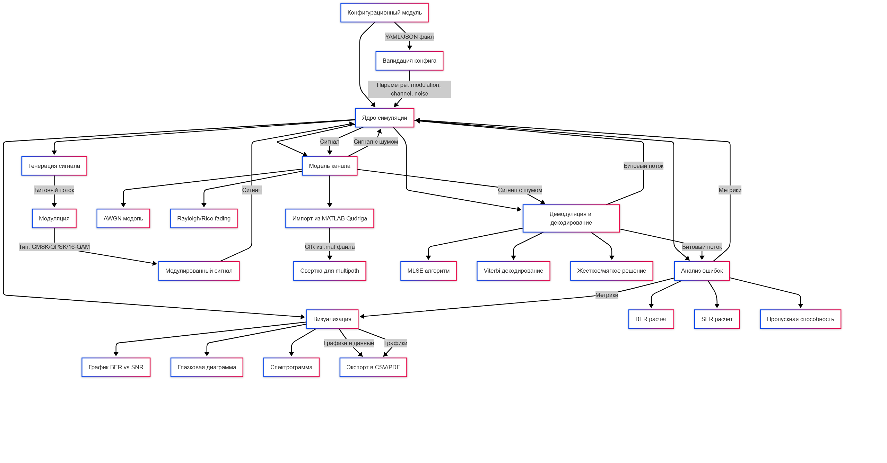
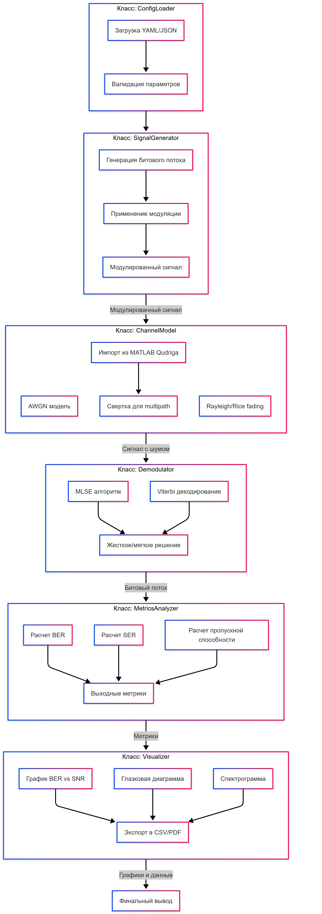

# Структура проекта

## Общая архитектура
Проект состоит из независимых модулей, связанных через четкие интерфейсы. Ниже представлена диаграмма взаимодействия модулей:



## Подмодули

### `config/`
- **Функционал:** Загрузка и валидация YAML/JSON-конфигураций.
- **Ключевые файлы:**
  - `loader.py`: Парсинг конфига.
  - `validator.py`: Проверка параметров.

### `signal_generation/`
- **Функционал:** Генерация битового потока и модуляция (GMSK/QPSK/16-QAM).
- **Ключевые файлы:**
  - `bit_generator.py`: Создание случайных битов.
  - `modulation.py`: Реализация модуляции.

### `channel/`
- **Функционал:** Моделирование канала (AWGN, Rayleigh/Rice fading, QudrigaImporter).
- **Ключевые файлы:**
  - `awgn.py`: Добавление белого шума.
  - `qudriga_importer.py`: Чтение `.mat`-файлов.

### `demodulation/`
- **Функционал:** Демодуляция и коррекция ошибок (MLSE, Viterbi).
- **Ключевые файлы:**
  - `mlse.py`: Алгоритм MLSE.
  - `viterbi.py`: Декодирование Витерби.

### `analysis/`
- **Функционал:** Расчет BER/SER, построение графиков.
- **Ключевые файлы:**
  - `metrics.py`: Вычисление метрик.
  - `plotter.py`: Визуализация результатов.

### `core_simulation.py`
- **Функционал:** Orchestrator симуляции. 
  ```python
  signal = generate_signal(config)
  signal = apply_channel(signal, config)
  demodulated_bits = demodulate(signal, config)

